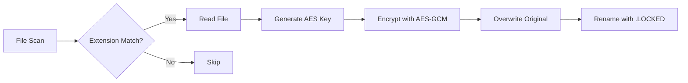

# Ransomware Research Project: Windows Paralysis

## Disclaimer

This is a research project for academic purposes only. Unauthorized use on any system is illegal and unethical. **Researchers assume full responsibility for their actions.**

---

## Overview

This advanced ransomware simulation demonstrates comprehensive Windows system paralysis techniques, including:

* File encryption with AES-256-GCM
* Master Boot Record (MBR) overwrite
* Boot configuration destruction
* System recovery disabling
* Network/USB propagation
* Anti-forensic capabilities

Designed for cybersecurity research in controlled environments to study:

* Ransomware attack vectors
* Windows security weaknesses
* Digital forensics and incident response
* Malware detection techniques

---

## Key Features

### 1. Boot Destruction System

| Component    | Technique                     | Effect                                   |
| ------------ | ----------------------------- | ---------------------------------------- |
| MBR          | Direct disk access + ASM code | Infinite boot loop with visual artifacts |
| BCD Store    | Creation of invalid entries   | Unbootable system configuration          |
| Kernel Files | `ntoskrnl.exe` overwrite      | Critical OS component destruction        |
| WinRE        | Partition deletion            | Recovery environment removal             |

### 2. File Encryption Engine



* **Algorithm:** AES-256-GCM with PBKDF2 key derivation
* **Threading:** 16 parallel encryption workers
* **Targets:** 18+ file extensions (documents, images, databases)
* **Max Size:** 250MB per file

### 3. Persistence Mechanisms

* **Registry:** 4 locations (`Run`, `RunOnce`, `Policies`, `Winlogon`)
* **Scheduled Tasks:** Advanced triggers (logon, calendar, event-based)
* **Startup Folder:** Masquerading as Windows Update
* **System Folders:** Hidden copies in protected locations

### 4. Defense Evasion

```go
func disableDefenses() {
    // Disables 10+ security services
    // Kills AV processes
    // Disables firewall and UAC
    // Turns off Windows Update
}
```

### 5. Propagation Modules

| Vector  | Technique                          | Target                   |
| ------- | ---------------------------------- | ------------------------ |
| Network | `ADMIN$` share + scheduled tasks   | All ARP-discovered hosts |
| USB     | Malicious LNK + hidden executables | All removable drives     |

---

## Research Setup

### Prerequisites

* VMware/VirtualBox with snapshot support
* Windows 10/11 VM (64-bit)
* Go 1.20+ compiler
* Isolated network segment

### Building the Research Sample

```bash
# Build for Windows (amd64)
GOOS=windows GOARCH=amd64 go build -ldflags="-s -w" -o ransomware.exe main.go

# Obfuscate binary (optional)
upx --best ransomware.exe
```

### Safe Execution Protocol

1. Create VM snapshot before execution
2. Disable network adapter
3. Run as Administrator:

```powershell
.\ransomware.exe
```

4. Observe:

   * File encryption progress
   * Boot sequence changes
   * Persistence mechanisms
5. Restore snapshot immediately after observation

---

## Post-Execution Effects

### Immediate:

* All target files encrypted and renamed
* Ransom notes on desktop and public folders
* Security services disabled

### After Reboot:

* MBR corruption prevents booting
* Boot screen shows custom message
* No recovery options available
* System completely inoperable

---

## Forensic Analysis Tips

### Memory Analysis:

* Look for AES key schedules in RAM
* Detect unhooked system calls

### Disk Analysis:

* Check `$MFT` for mass file renames
* Examine registry hives for persistence

### Network Analysis:

* Monitor Tor proxy connections
* Analyze C2 communication patterns

### Artifact Hunting:

* Scheduled task XML files
* Prefetch execution records
* Windows event logs (if not cleared)

---

## Ethical Guidelines

### CONTAINMENT

Always use fully isolated lab environments

### CONSENT

Never deploy on unauthorized systems

### CONTROL

Implement dead-man switches in code:

```go
if !isVirtualized() {
    os.Exit(0) // Only runs in VMs
}
```

### DOCUMENTATION

Maintain detailed research logs

---

## Research Value

| Area                  | Study Focus                            |
| --------------------- | -------------------------------------- |
| Detection Engineering | Signature vs behavior-based detection  |
| DFIR                  | Forensic artifact recovery             |
| Mitigation            | Controlled folder access effectiveness |
| Threat Intelligence   | TTP (Tactics, Techniques, Procedures)  |

---

## Legal Disclaimer

This software is provided "as is" for educational purposes only. The authors disclaim all responsibility for illegal or unethical use. Researchers are solely liable for ensuring compliance with all applicable laws, including but not limited to:

* Computer Fraud and Abuse Act (CFAA)
* General Data Protection Regulation (GDPR)
* Local cybersecurity legislation

**By using this software, you agree that you are solely responsible for your actions and any consequences that may result.**

---

## Contact

**For research collaboration:**

* Email: [academic-security@example.edu](mailto:academic-security@example.edu)
* PGP: `0xDEADBEEF`
